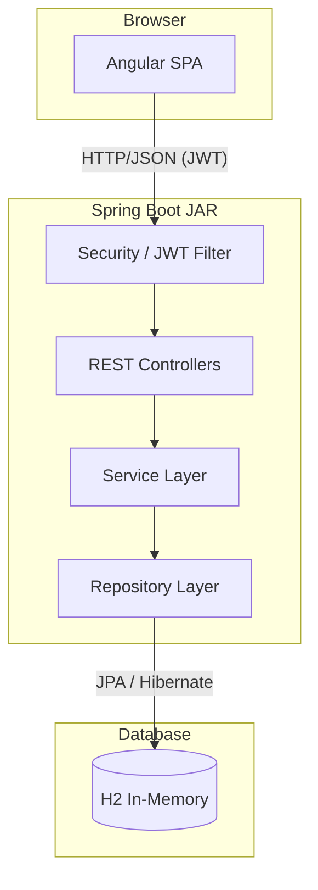
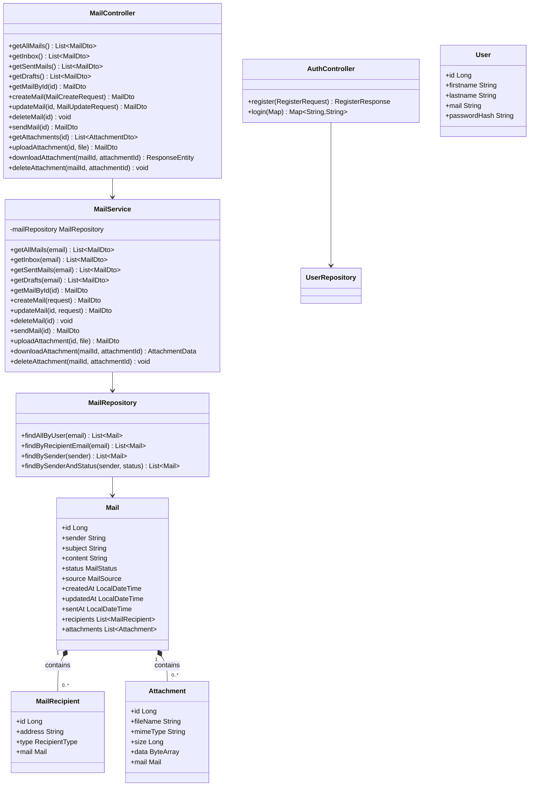
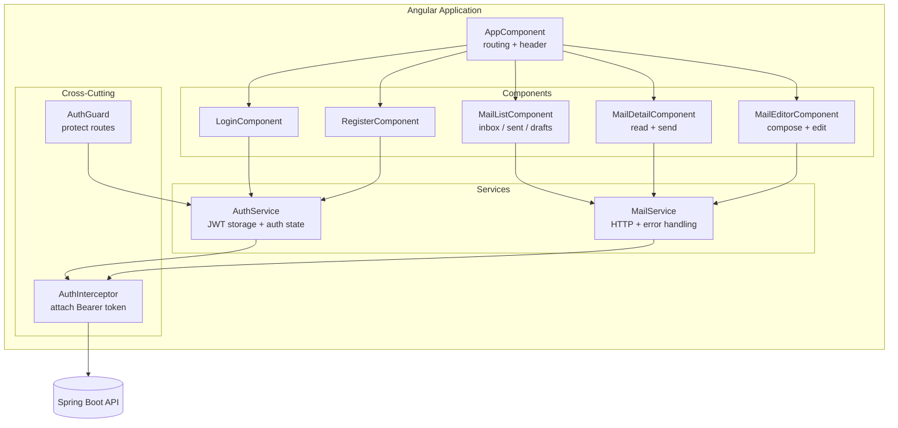
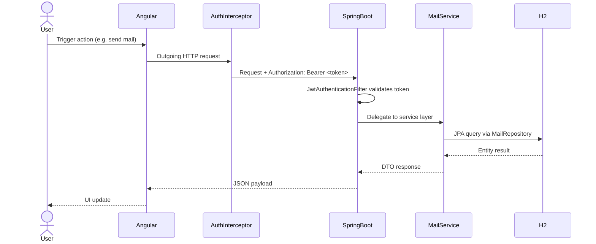
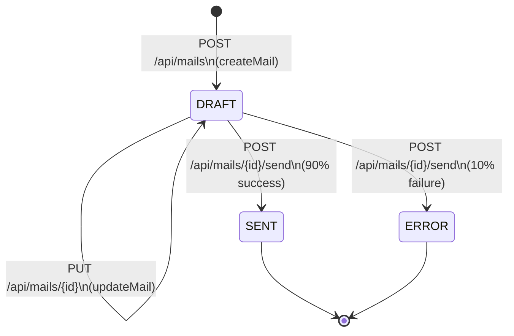
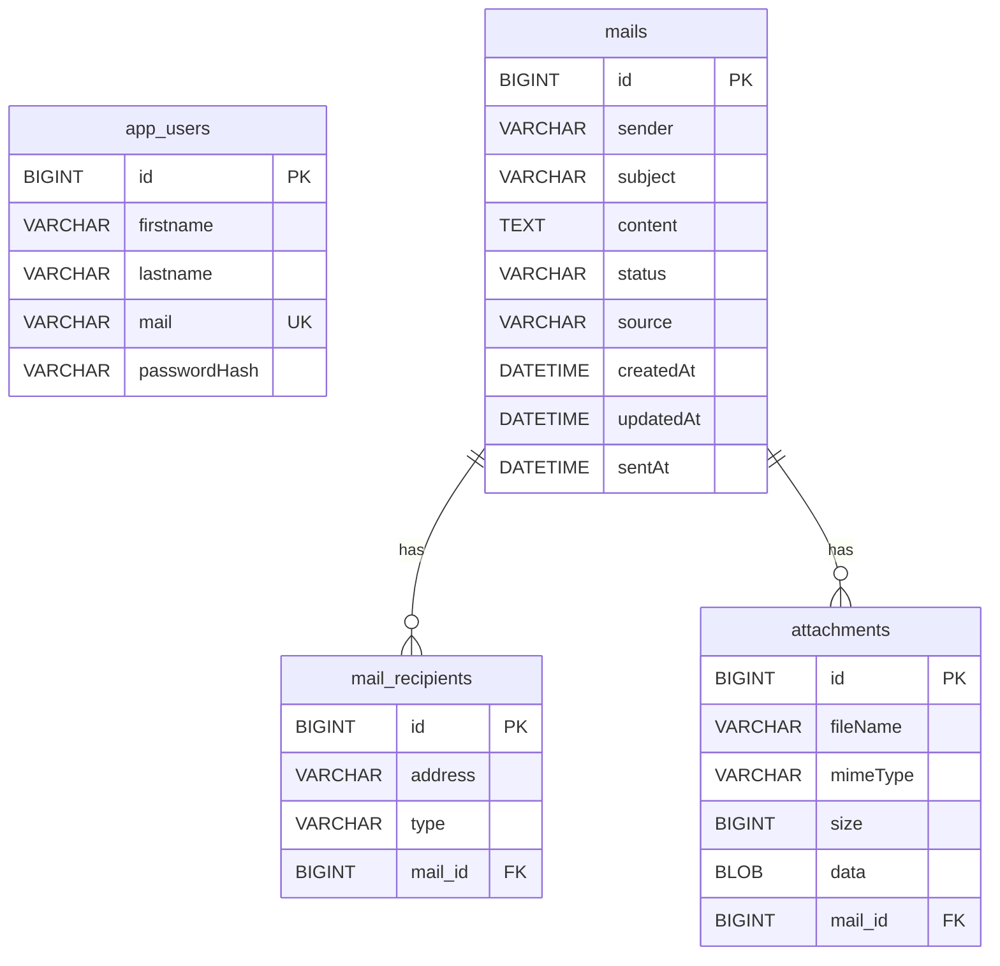

# THM Mail-System

A full-stack, three-tier mail system built with **Angular** (Frontend), **Spring Boot / Kotlin** (Backend), and **H2** (in-memory database). The project demonstrates strict architectural layering, JWT-based security, type-safe communication, and clean code principles.

---

## Table of Contents

1. [Overview](#overview)
2. [Key Features](#key-features)
3. [Technical Architecture](#technical-architecture)
   - [System Overview](#system-overview)
   - [Backend Layer](#backend-layer)
   - [Frontend Layer](#frontend-layer)
   - [Request Flow](#request-flow)
   - [Mail Status Lifecycle](#mail-status-lifecycle)
4. [Project Structure](#project-structure)
5. [Database Schema](#database-schema)
6. [API Reference](#api-reference)
7. [Quick Start](#quick-start)
8. [Test Credentials](#test-credentials)
9. [Technologies Used](#technologies-used)

---

## Overview

THM Mail-System is a distributed mail application that simulates real-world email workflows. Users can register, log in, compose drafts, add file attachments, and send emails. The application is served as a single deployable unit: Gradle compiles the Angular frontend and embeds it inside the Spring Boot JAR, so no separate server is needed.

---

## Key Features

### Functional
- Full **CRUD** operations for emails (create, read, update, delete).
- **Send** emails with a simulated 90 % success / 10 % failure rate.
- Dedicated **Inbox**, **Sent**, and **Drafts** folder views.
- **File attachments** — upload, download, and delete (draft mails only).
- Automatic sample data initialization on startup.
- JWT-based **authentication** with registration and login.

### Code Quality & Architecture
- Strict three-layer separation: Components → Services → REST API.
- All HTTP communication is encapsulated in Angular services — no `HttpClient` in components.
- 100 % type-safe TypeScript — zero `any` usage.
- Memory-leak-free Observable management via the `takeUntil()` pattern.
- Centralized error handling with user-friendly messages on both layers.
- Proper `OnDestroy` lifecycle management across all Angular components.

---

## Technical Architecture

### System Overview



### Backend Layer

The backend follows a classic three-tier pattern. Each layer has a single, well-defined responsibility:



### Frontend Layer



### Request Flow



### Mail Status Lifecycle



---

## Project Structure

```text
mail-system/
│
├── src/                                         # Spring Boot Backend (Kotlin)
│   └── main/
│       ├── kotlin/de/thm/mni/mailsystem/
│       │   ├── config/
│       │   │   ├── JwtUtils.kt                  # JWT generation & validation
│       │   │   ├── JwtAuthenticationFilter.kt   # Per-request token filter
│       │   │   └── SecurityConfig.kt            # Spring Security setup
│       │   ├── controller/
│       │   │   ├── AuthController.kt            # POST /api/auth/register|login
│       │   │   └── MailController.kt            # /api/mails/** endpoints
│       │   ├── dto/
│       │   │   ├── AuthDTOs.kt                  # RegisterRequest / RegisterResponse
│       │   │   ├── MailDTOs.kt                  # MailCreateRequest / MailUpdateRequest
│       │   │   └── ResponseDTOs.kt              # MailDto / AttachmentDto + mappers
│       │   ├── model/
│       │   │   ├── User.kt                      # app_users table
│       │   │   ├── Mail.kt                      # mails table + enums
│       │   │   ├── MailRecipient.kt             # mail_recipients table
│       │   │   └── Attachment.kt                # attachments table
│       │   ├── repository/
│       │   │   ├── UserRepository.kt            # findByMail()
│       │   │   └── MailRepository.kt            # custom JPQL queries
│       │   └── service/
│       │       └── MailService.kt               # All business logic + transactions
│       └── resources/
│           └── application.properties           # DB, JWT, multipart config
│
├── mail-client/                                 # Angular Frontend (TypeScript)
│   └── src/app/
│       ├── components/
│       │   ├── login/                           # Login form
│       │   ├── register/                        # Registration form
│       │   ├── mail-list/                       # Folder view (inbox/sent/drafts)
│       │   ├── mail-detail/                     # Single mail reader
│       │   └── mail-editor/                     # Compose & edit form
│       ├── services/
│       │   ├── auth.service.ts                  # Login, logout, token storage
│       │   └── mail.service.ts                  # All mail + attachment HTTP calls
│       ├── guards/
│       │   └── auth.guard.ts                    # Redirect unauthenticated users
│       ├── interceptors/
│       │   └── auth.interceptor.ts              # Attach JWT + handle 401
│       ├── models/
│       │   ├── auth.dto.ts                      # LoginCredentials, RegisterCredentials
│       │   └── mail.model.ts                    # Mail, MailRecipient, AttachmentMetadata
│       ├── app.routes.ts                        # Route definitions
│       └── app.config.ts                        # App-level providers
│
├── build.gradle.kts                             # Gradle build (includes buildAngular task)
└── settings.gradle.kts
```

---

## Database Schema



**Enum values:**

| Column | Values |
|--------|--------|
| `mails.status` | `DRAFT`, `SENT`, `ERROR` |
| `mails.source` | `INTERN`, `EXTERN` |
| `mail_recipients.type` | `TO`, `CC`, `BCC`, `REPLY_TO` |

---

## API Reference

### Authentication

| Method | Endpoint | Auth | Description |
|--------|----------|------|-------------|
| `POST` | `/api/auth/register` | Public | Register a new user account |
| `POST` | `/api/auth/login` | Public | Authenticate and receive a JWT token |

### Mail Operations

| Method | Endpoint | Auth | Description |
|--------|----------|------|-------------|
| `GET` | `/api/mails` | JWT | All mails for the authenticated user |
| `GET` | `/api/mails/inbox` | JWT | Received mails (user is a recipient) |
| `GET` | `/api/mails/sent` | JWT | Successfully sent mails |
| `GET` | `/api/mails/drafts` | JWT | Unsent draft mails |
| `GET` | `/api/mails/{id}` | JWT | Single mail with full detail |
| `POST` | `/api/mails` | JWT | Create a new mail (status = `DRAFT`) |
| `PUT` | `/api/mails/{id}` | JWT | Update a draft mail |
| `DELETE` | `/api/mails/{id}` | JWT | Permanently delete a mail |
| `POST` | `/api/mails/{id}/send` | JWT | Send a draft (90 % success rate) |

### Attachment Operations

| Method | Endpoint | Auth | Description |
|--------|----------|------|-------------|
| `GET` | `/api/mails/{id}/attachments` | JWT | List attachment metadata for a mail |
| `POST` | `/api/mails/{id}/attachments` | JWT | Upload a file to a draft mail |
| `GET` | `/api/mails/{mailId}/attachments/{attachmentId}/download` | JWT | Download file binary |
| `DELETE` | `/api/mails/{mailId}/attachments/{attachmentId}` | JWT | Delete an attachment from a draft |

---

## Quick Start

**Prerequisites:** JDK 17+, Node.js 18+, npm

### Development Mode

```bash
cd mail-system
./gradlew bootRun # Build frontend and start Spring Boot server
```

The Gradle build will automatically:
1. Run `npm install` and build the Angular frontend (`buildAngular` task).
2. Copy the compiled frontend into `src/main/resources/static`.
3. Start the Spring Boot application with the frontend embedded.

Open your browser at **http://localhost:8080**.

> **Windows users:** use `.\gradlew bootRun` in PowerShell.

## Production Deployment
For Production, use a persistent database and secure configuration:
```bash
# 1. Build the application
./gradlew clean build

# 2. Set environment variables
export DB_PASSWORD="your-secure-password"
export JWT_SECRET="your-secure-jwt-secret-key"

# 3. Run with production profile
java -jar build/libs/mail-system-*.jar --spring.profiles.active=prod
```
### Production Checklist:
-  Replace H2 with PostgreSQL/MySQL
-  Use strong JWT secret (``generate with openssl rand -base64 64``)
-  Store passwords in environment variables (never in code)
-  Disable H2 console (``spring.h2.console.enabled=false``)
-  Set spring.jpa.hibernate.ddl-auto=validate (never ``update`` in prod)
---

## Test Credentials (Development Only)

| Email | Password | Role |
|-------|----------|------|
| `student@thm.de` | `password123` | Student |
| `prof@thm.de` | `password123` | Professor |
| `admin@thm.de` | `admin123` | Admin |

---

## Technologies Used

| Layer | Technology |
|-------|-----------|
| Frontend | Angular 18+, TypeScript, RxJS, Reactive Forms |
| Backend | Spring Boot 4.0, Kotlin, Spring Security, Spring Data JPA |
| Auth | JSON Web Tokens (JWT), BCrypt password hashing |
| Database | H2 in-memory (Hibernate / JPA) |
| Build | Gradle (Kotlin DSL), npm |